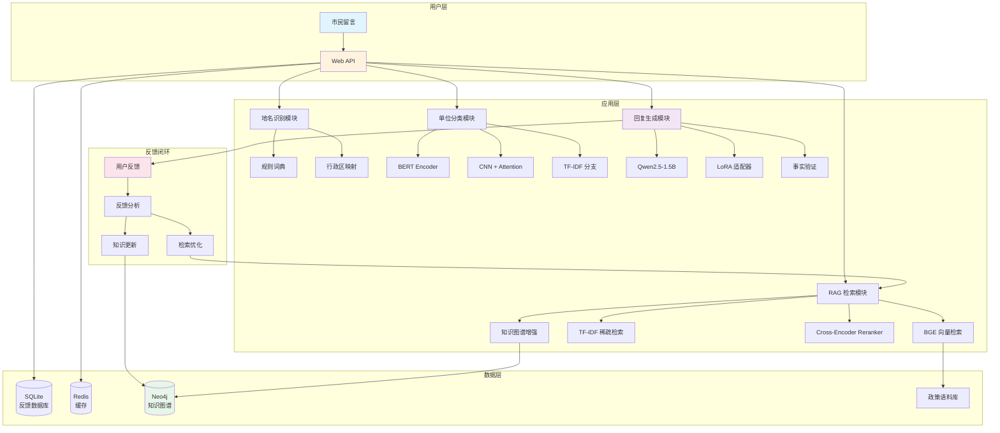
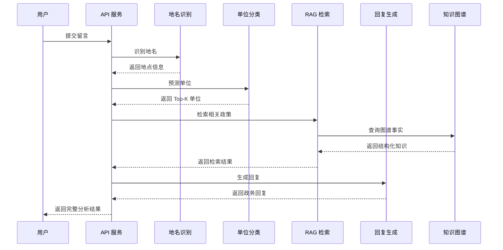

# 接诉即办智能服务系统

[](https://www.python.org/downloads/)
[](https://pytorch.org/)
[](https://flask.palletsprojects.com/)
[](LICENSE)

一个面向政务留言的智能分析与回复生成系统，集成了地名识别、单位分类、RAG 检索、回复生成和知识图谱等功能。

## ✨ 核心功能

- **地名识别**：基于规则词典 + 运行时地点库 + 行政区映射的北京地名识别
- **单位分类**：BERT/RoBERTa + CNN + Attention + TF-IDF 混合分类模型
- **RAG 检索**：BGE 向量检索 + TF-IDF 稀疏检索 + Cross-Encoder Reranker
- **回复生成**：Qwen2.5-1.5B-Instruct + LoRA 微调生成政务回复
- **知识图谱**：结构化知识管理 + RAG 深度集成
- **反馈闭环**：用户反馈驱动的检索质量优化

## 🏛️ 系统架构



### 数据流程



## 🚀 快速开始

### 方式一：Docker 部署（推荐）

```bash
# 1. 克隆仓库
git clone https://github.com/ckhongdadada/jiesujiban_web.git
cd jiesujiban_web

# 2. 准备模型文件到 models/ 目录
# - local_roberta_model/ (分类基础模型)
# - final_model_fgm/ (分类微调权重)
# - qwen_models/Qwen/Qwen2.5-1.5B-Instruct/ (生成模型)
# - qwen_reply_model/ (生成微调权重)

# 3. 启动服务
./docker-deploy.sh up    # Linux/Mac
.\docker-deploy.bat up   # Windows

# 4. 访问服务
# http://localhost:5000
```

### 方式二：本地运行

```bash
# 1. 克隆仓库
git clone https://github.com/ckhongdadada/jiesujiban_web.git
cd jiesujiban_web

# 2. 创建虚拟环境
python -m venv .venv
source .venv/bin/activate  # Linux/Mac
.\.venv\Scripts\activate   # Windows

# 3. 安装依赖
pip install -r requirements.txt
pip install -r requirements_optional_rag_ner.txt

# 4. 配置环境变量
cp configs/app/.env.example .env
# 编辑 .env 文件，配置模型路径

# 5. 启动服务
python app.py
```

## 📖 API 文档

### 核心接口

| 接口 | 方法 | 说明 |
|------|------|------|
| `/api/health` | GET | 健康检查 |
| `/api/analyze` | POST | 完整分析链路 |
| `/api/predict` | POST | 单位分类预测 |
| `/api/generate` | POST | 回复生成 |
| `/api/search` | POST | RAG 检索 |
| `/api/feedback` | POST | 提交反馈 |
| `/api/rag/reload` | POST | RAG 热更新 |

### 示例请求

```bash
# 完整分析
curl -X POST http://localhost:5000/api/analyze \
  -H "Content-Type: application/json" \
  -d '{
    "tag": "投诉",
    "title": "小区垃圾没人清理",
    "body": "我们小区垃圾堆积严重，已经一周没人清理了。"
  }'

# RAG 检索
curl -X POST http://localhost:5000/api/search \
  -H "Content-Type: application/json" \
  -d '{
    "query": "垃圾清运问题处理流程",
    "top_k": 5
  }'
```

## 🏗️ 项目结构

```
src/jsjb/
├── web/                 # Web 层，Flask 应用
├── location/            # 地名识别、区县映射、消歧
├── retrieval/           # RAG 检索（BGE + TF-IDF + Reranker）
├── unit_classifier/     # 回复单位分类
├── reply_generation/    # Qwen + LoRA 回复生成
├── feedback/            # 用户反馈存储
├── knowledge/           # 知识图谱、结构化知识库
├── active_learning/     # 主动学习模块
└── core/                # 配置、路径、日志等公共能力

configs/                 # 配置文件
scripts/                 # 可执行脚本
tests/                   # 测试代码
docker/                  # Docker 配置
```

## 🔧 配置说明

### 环境变量

| 变量 | 说明 | 默认值 |
|------|------|--------|
| `CLASSIFIER_MODEL_DIR` | 分类模型目录 | `./final_model_fgm` |
| `GENERATOR_BASE_MODEL` | 生成模型路径 | `./qwen_models/Qwen/Qwen2.5-1.5B-Instruct` |
| `NEO4J_URI` | Neo4j 连接地址 | `bolt://localhost:7687` |
| `REDIS_HOST` | Redis 主机 | `localhost` |

### RAG 配置

```json
{
  "rag_enable_chunking": true,
  "rag_chunk_size": 400,
  "rag_enable_reranker": true,
  "rag_enable_graph_augment": true,
  "rag_enable_feedback_boost": true
}
```

## 🧪 测试

```bash
# 运行所有测试
pytest

# 运行特定测试
pytest tests/retrieval/test_retriever_rank.py

# 生成覆盖率报告
pytest --cov=src/jsjb --cov-report=html
```

## 📊 性能指标

| 指标 | 数值 |
|------|------|
| 分类 Top-1 准确率 | 85%+ |
| 分类 Top-3 准确率 | 95%+ |
| RAG 检索延迟 | < 100ms |
| 回复生成延迟 | < 2s |

## 🛠️ 技术栈

- **后端框架**：Flask
- **深度学习**：PyTorch, Transformers, PEFT
- **向量检索**：BGE Embeddings, FAISS
- **生成模型**：Qwen2.5-1.5B-Instruct + LoRA
- **数据库**：SQLite (反馈), Redis (缓存), Neo4j (图谱)
- **容器化**：Docker, Docker Compose

## 📚 文档

- [API 文档](docs/API文档.md)
- [Docker 部署指南](docs/Docker部署指南.md)
- [运维手册](docs/运维手册.md)
- [知识图谱与主动学习](docs/KNOWLEDGE_GRAPH_AND_ACTIVE_LEARNING.md)
- [未来扩展路线图](docs/FUTURE_EXPANSION_ROADMAP.md)

## 🤝 贡献

欢迎提交 Issue 和 Pull Request！

1. Fork 本仓库
2. 创建特性分支 (`git checkout -b feature/AmazingFeature`)
3. 提交更改 (`git commit -m 'Add some AmazingFeature'`)
4. 推送到分支 (`git push origin feature/AmazingFeature`)
5. 提交 Pull Request

## 📄 许可证

本项目采用 MIT 许可证 - 详见 [LICENSE](LICENSE) 文件

## 🙏 致谢

- [Hugging Face](https://huggingface.co/) - Transformers 库和预训练模型
- [BAAI](https://www.baai.ac.cn/) - BGE 向量模型和 Reranker
- [Qwen Team](https://github.com/QwenLM) - Qwen 大语言模型

---

**注意**：本项目仅供学习和研究使用，不建议直接用于生产环境。
