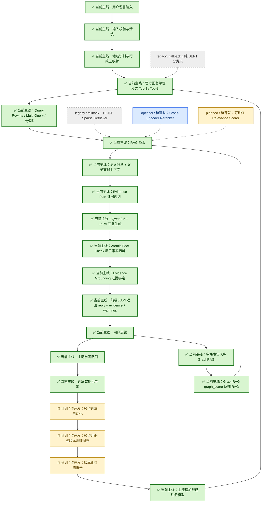
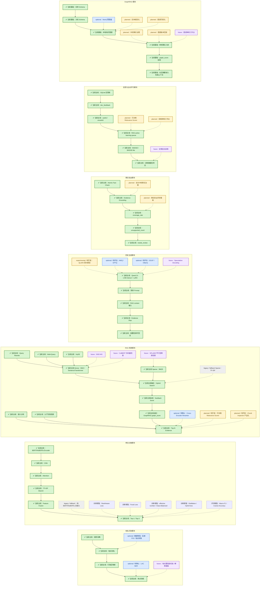
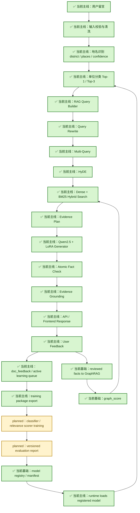
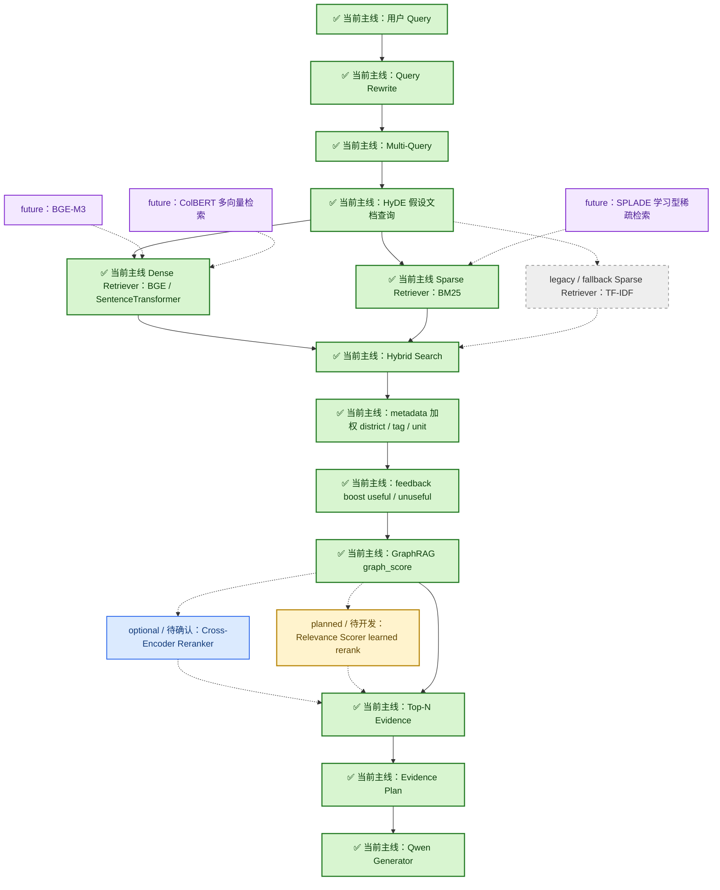
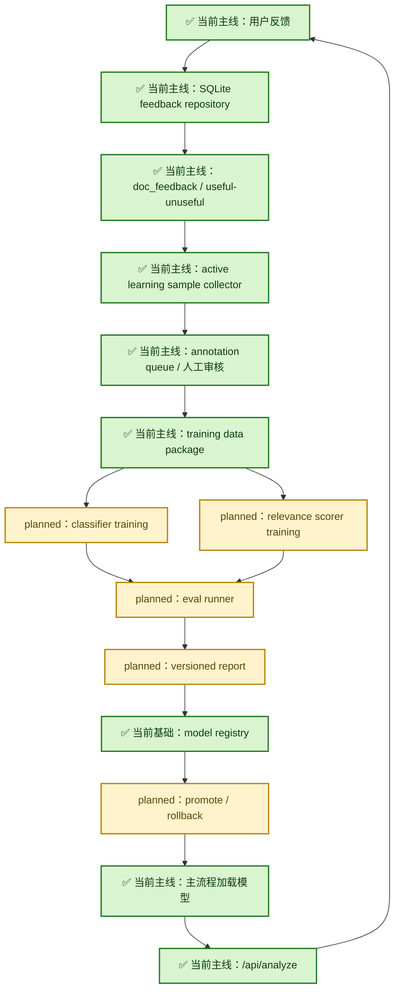

# 接诉即办智能服务系统：报告书新版

生成日期：2026-05-07  
适用项目：`C:\Users\28414\PycharmProjects\接诉即办项目`  
系统定位：基于 RAG、单位分类、Qwen + LoRA 生成、事实验证、反馈闭环与 GraphRAG 的政务留言智能分析与自动回复系统。

---

## 0. 执行摘要

接诉即办智能服务系统当前已经从早期的模型脚本集合，逐步升级为一个模块化、可扩展、可评测的政务留言智能处理工程系统。系统不是简单的大模型套壳，而是围绕政务留言处理流程，集成了地名识别、官方回复单位分类、RAG 检索、Qwen + LoRA 回复生成、事实验证、证据绑定、用户反馈、主动学习和 GraphRAG 知识图谱等多个能力模块。

当前系统已经具备较完整的主链路：用户输入留言后，系统会进行输入校验与清洗，识别地点和行政区，预测官方回复单位 Top-1 / Top-3，经过 Query Rewrite、Multi-Query、HyDE 等查询增强后进入 RAG 检索，再由 BGE / SentenceTransformer Dense Retriever 与 BM25 Sparse Retriever 共同召回证据，经过 Hybrid Search、feedback boost、GraphRAG graph_score 等机制加权排序，最终将证据组织为 Evidence Plan，并传递给 Qwen2.5-1.5B-Instruct + LoRA 生成政务回复。生成结果随后进入 Atomic Fact Check 与 Evidence Grounding，输出 coverage_rate、unsupported_count、needs_review 和 verification warnings，最后通过前端或 API 返回。

当前阶段的主要矛盾已经不是“有没有功能”，而是“功能是否可评测、可解释、可纠错、可持续学习、可稳定演示”。下一阶段重点不是继续堆模型，而是补齐固定分层评测集、版本化评测报告、评测与演示看板、正式分类模型训练、RAG relevance scorer、GraphRAG 质量治理和模型产物版本治理。

本报告书新版用于阶段汇报、开发排期、后续验收和论文 / 答辩材料扩展。原论文调研计划书继续保留为长期技术路线，本报告书更聚焦当前项目真实代码状态、当前主链路、旧版链路、可选链路、待开发链路和未来增强方向。

## 1. 项目背景与系统定位

接诉即办场景具有强业务约束、强地域属性和强事实要求。市民留言往往包含地点、问题类型、责任主体、政策依据、历史案例、办理结果等多种信息，系统需要同时解决“看懂留言”“判断责任单位”“检索依据”“生成规范回复”“验证事实”“接收反馈”“持续改进”等问题。

该系统不能只依赖大模型参数知识。政务回复具有明确的事实边界和责任边界，生成内容必须尽量依托外部知识库、历史案例、政策材料和可追溯证据。因此，当前架构采用 RAG（检索增强生成）作为核心范式，并在此基础上加入单位分类、地名识别、证据绑定、事实验证、用户反馈和 GraphRAG。

| 维度 | 定位 |
|---|---|
| 技术定位 | 基于 RAG 的政务留言智能分析与自动回复系统 |
| 应用定位 | 面向北京市接诉即办、留言板、政务咨询和投诉回复辅助场景 |
| 模型定位 | 分类模型负责责任单位预测，RAG 负责证据召回，Qwen + LoRA 负责可控生成 |
| 工程定位 | 模块化、可评测、可解释、可反馈、可持续学习的政务智能平台 |
| 当前阶段 | 从功能可运行进入评测、解释、纠错、学习和治理增强阶段 |

## 2. 当前系统总体架构：细化版

### 2.1 系统主流程总览图



### 2.2 模块分支图总览



### 2.3 模块目录与工程落点

| 模块 | 主要目录或文件 | 说明 |
|---|---|---|
| Web/API 层 | `src/jsjb/web/` | Flask 应用、路由、系统状态、分析接口、反馈接口、评测接口 |
| 地名识别 | `src/jsjb/location/` | 规则地名识别、地点消歧、别名与实验缓存实现 |
| 单位分类 | `src/jsjb/unit_classifier/` | BERT/RoBERTa + CNN + Attention + TF-IDF 模型、运行时、训练、损失函数、主动学习 |
| RAG 检索 | `src/jsjb/retrieval/` | BGE Dense、BM25 Sparse、Hybrid Search、Query Rewrite、HyDE、语义分块、父子检索、反馈加权、GraphRAG 加权 |
| 回复生成 | `src/jsjb/reply_generation/` | Qwen + LoRA 生成、证据计划、事实拆解、事实验证、错误分析 |
| 用户反馈 | `src/jsjb/feedback/` | SQLite 反馈库、doc_feedback、反馈统计和归因 |
| 主动学习 | `src/jsjb/active_learning/` | 样本队列、人工审核、BADGE 候选、训练数据包导出 |
| 知识图谱 | `src/jsjb/knowledge/` | 图谱 Schema、本地图谱、Neo4j 管理器、审核事实入库、结构化知识库 |
| 评测体系 | `src/jsjb/evaluation/` | RAG 评测、生成质量评测、批量质量评测 |
| 配置治理 | `configs/`、`src/jsjb/core/config.py` | 应用配置、检索配置、生成配置、模型注册配置 |
| 模型治理 | `src/jsjb/core/model_registry.py`、`src/jsjb/core/model_manifest.py` | 模型注册、模型 manifest、兼容性检查 |

## 3. 技术路线分支说明：当前主线、旧版链路与未来增强

### 3.1 RAG 检索路线

| 模块 | 技术路线 | 状态 | 是否当前主线 | 说明 |
|---|---|---|---|---|
| Dense 检索 | BGE / SentenceTransformer | 已接入 | 是 | 当前语义召回主线 |
| Sparse 检索 | BM25 | 已接入 | 是 | 当前稀疏检索主线，替代单纯 TF-IDF 作为推荐稀疏链路 |
| Sparse 检索 | TF-IDF | legacy / fallback | 否 | 旧版稀疏检索，可保留为对照实验或备用链路 |
| 排序融合 | Hybrid Search | 已接入 | 是 | 融合 Dense、Sparse、metadata、feedback、graph_score |
| 查询增强 | Query Rewrite | 已接入 | 是 | 对用户原始 Query 做规则或模板改写 |
| 查询增强 | Multi-Query | 已接入 | 是 | 从多个角度生成查询，提高召回覆盖 |
| 查询增强 | HyDE | 已接入 | 是 | 生成假设文档查询，用于低召回补救 |
| 上下文组织 | 语义分块 | 已接入 | 是 | 以语义边界组织 chunk，减少长文档稀释 |
| 上下文组织 | 父子文档检索 | 已接入 | 是 | 小 chunk 检索，大 chunk 或父文档作为上下文 |
| 精排 | Cross-Encoder Reranker | 接口存在 / 待确认 | 否 / 可选 | 需要确认本地模型、稳定部署和效果收益 |
| 反馈排序 | 启发式 feedback boost | 已接入 | 是 | 当前 useful / unuseful 的主要作用方式 |
| 反馈排序 | 可训练 Relevance Scorer | 未完成 | 否 | 后续重点建设，目标是从反馈中学习排序能力 |
| 多向量检索 | ColBERT | 未来计划 | 否 | 长文档细粒度匹配增强 |
| 学习型稀疏检索 | SPLADE | 未来计划 | 否 | BM25 之后的增强方向 |
| Embedding 增强 | BGE-M3 | 未来计划 | 否 | 更强多功能 embedding 模型预研方向 |

### 3.2 单位分类路线

| 模块 | 技术路线 | 状态 | 是否当前主线 | 说明 |
|---|---|---|---|---|
| 编码器 | BERT/RoBERTa Encoder | 已接入 | 是 | 当前文本语义编码主干 |
| 局部特征 | CNN | 已接入 | 是 | 提取局部 n-gram 模式 |
| 重点聚合 | Attention | 已接入 | 是 | 聚合重要 token 和语义片段 |
| 稀疏分支 | TF-IDF Branch | 已接入 | 是 | 补充关键词和单位相关稀疏信号 |
| 融合分类 | Feature Fusion + Linear Classifier | 已接入 | 是 | 输出 logits 并生成 Top-1 / Top-3 |
| 旧版分类 | 纯 BERT/RoBERTa 分类头 | legacy / fallback | 否 | 旧版或对照路线，不作为正式主链路 |
| 训练增强 | RankAware Loss | 已接入 | 是 / 训练增强 | 优化 Top-K 场景，尤其关注 Top-3 可接受性 |
| 训练增强 | Focal Loss | 已接入 | 是 / 训练增强 | 强化困难样本和长尾样本 |
| 训练增强 | effective number / Class-Balanced | 代码基础已接入 | 待正式训练 | 需要通过正式训练和消融验证收益 |
| 训练增强 | Distillation / hybrid loss | 已接入 | 待正式训练 | 训练增强方向，仍需正式训练和消融实验 |
| 评测增强 | Top-1 / Top-3 / Macro-F1 / Coarse Accuracy | 部分完成 | 是 / 评测增强 | 指标体系已有基础，但版本化报告仍需完善 |

### 3.3 生成路线

| 模块 | 技术路线 | 状态 | 是否当前主线 | 说明 |
|---|---|---|---|---|
| 基础模型 | Qwen2.5-1.5B-Instruct | 已接入 | 是 | 当前回复生成基础模型 |
| 领域适配 | LoRA adapter | 已接入 | 是 | 当前政务回复生成适配方式 |
| Prompt | 政务回复 Prompt | 已接入 | 是 | 约束无问候、无落款、不过度承诺、基于证据回复 |
| 上下文输入 | RAG context | 已接入 | 是 | 将检索证据传入生成器 |
| 证据规划 | Evidence Plan | 已接入 | 是 | 生成前组织证据使用计划 |
| 保守回复 | 低置信保守回复 | 已接入 | 是 | 在证据不足或低置信时降低臆测风险 |
| 训练增强 | QLoRA 更大模型 | 入口和配置存在 | 否 / 待开发 | 训练入口不等于正式模型已完成 |
| 量化部署 | AWQ / GPTQ | 待评估 | 否 | 推理优化方向 |
| 本地演示 | GGUF / Ollama | 待评估 | 否 | 演示和部署便利性方向 |
| 生成加速 | Speculative Decoding | experimental / future | 否 | 小模型草稿 + 大模型验证，需后续验证 |

### 3.4 GraphRAG 路线

| 模块 | 技术路线 | 状态 | 是否当前主线 | 说明 |
|---|---|---|---|---|
| 图谱建模 | 实体 Schema / 关系 Schema | 已接入 | 是 / 当前基础 | 支撑地点、单位、政策、案例、资源、事实等结构化 |
| 图谱存储 | 本地知识图谱 | 已接入 | 是 / 当前基础 | 当前可用基础能力 |
| 图数据库 | Neo4j 管理器 | 可选 | 否 / optional | 需要确认正式部署方式 |
| 入库流程 | 审核事实入库 | 已接入 | 是 / 当前基础 | 人工审核后的事实可进入图谱 |
| 检索增强 | graph_score 加权 | 已接入 | 是 / 当前基础 | 图谱可反哺 RAG 排序 |
| 上下文增强 | 社区摘要进入检索上下文 | 已接入 | 是 / 当前基础 | 图谱摘要可作为证据上下文补充 |
| 质量治理 | 实体规范化 | 未完成 | 否 / planned | 后续重点建设 |
| 冲突治理 | 冲突事实检测与消解 | 未完成 | 否 / planned | 后续重点建设 |
| 图谱运维 | 版本回滚 | 未完成 | 否 / planned | 防止错误事实污染图谱 |
| 展示能力 | 图谱可视化 | 未完成 | 否 / planned | 用于演示、审核和解释 |

## 4. 架构图标注规范

后续所有架构图统一使用以下标注，避免把旧版链路、实验链路或未来计划误写成当前主链路。

| 标注 | 含义 |
|---|---|
| ✅ 当前主线 | 当前项目实际正在使用或推荐使用的正式链路 |
| legacy / fallback | 旧版链路、备用链路或对照实验路线 |
| optional / 可选 | 已有接口或可选配置，但不是当前默认主线 |
| 🧪 experimental | 实验链路，可能已有代码但尚未稳定进入主流程 |
| planned / 待开发 | 文档中规划但尚未完整实现 |
| future / 未来增强 | 当前阶段完成后再考虑的长期增强方向 |

架构图中不能只画一个大框，例如“RAG 检索”。RAG 内部必须展开 Dense、Sparse、Hybrid、Rerank、GraphRAG、Feedback、Relevance Scorer 等分支。分类模块必须区分当前融合主线和纯 BERT legacy fallback。生成模块必须区分 Qwen + LoRA 当前主线与 QLoRA、AWQ、GPTQ、GGUF、Ollama、Speculative Decoding 等未来或待评估路线。

## 5. Mermaid 示例图

### 5.1 图一：系统主流程细化图



### 5.2 图二：RAG 检索内部细化图



### 5.3 图三：训练、评测、反馈闭环图



## 6. 后续改进的工程设计方案

### 6.1 RAG 检索内部设计

| 分支 | 路线 | 状态 |
|---|---|---|
| 当前主线 | Query -> Query Rewrite -> Multi-Query -> HyDE -> BGE Dense Retriever -> BM25 Sparse Retriever -> Hybrid Score Fusion -> feedback boost -> graph_score -> Top-N Evidence | ✅ 当前主线 |
| 旧版 / fallback | Query -> TF-IDF Sparse Retriever -> 与 Dense 分数做 fallback 融合或对照实验 | legacy / fallback |
| 待开发链路 | Query + hits -> Relevance Scorer -> learned relevance_score -> rerank | planned / 待开发 |
| 可选链路 | Query + hits -> Cross-Encoder Reranker -> rerank | optional / 待确认 |
| 未来增强 | BGE-M3 / ColBERT / SPLADE | future / 未来增强 |

涉及文件：`src/jsjb/retrieval/bge_retriever.py`、`src/jsjb/retrieval/components.py`、`configs/retrieval/rag.json`。

核心数据结构：`QueryContext`、`RetrievalHit`、`ScoreBreakdown`、`Evidence`、`FeedbackStats`、`GraphContext`。

| 函数名 | 参数 | 返回值 | 职责 |
|---|---|---|---|
| `rewrite_query` | `query: str, context: Dict` | `List[str]` | 生成改写查询 |
| `generate_multi_queries` | `query: str, n: int` | `List[str]` | 生成多查询 |
| `generate_hyde_query` | `query: str` | `str` | 生成 HyDE 假设文档查询 |
| `retrieve_dense` | `queries: List[str], top_k: int` | `List[Hit]` | 使用 BGE / SentenceTransformer 检索 |
| `retrieve_sparse_bm25` | `queries: List[str], top_k: int` | `List[Hit]` | 使用 BM25 当前主线稀疏检索 |
| `retrieve_sparse_tfidf` | `queries: List[str], top_k: int` | `List[Hit]` | 使用 TF-IDF legacy 检索 |
| `fuse_hybrid_scores` | `dense_hits, sparse_hits, config` | `List[Hit]` | 融合 Dense / Sparse 分数 |
| `apply_feedback_boost` | `hits: List[Hit], feedback_stats: Dict` | `List[Hit]` | 根据 useful / unuseful 做启发式加权 |
| `apply_graph_score` | `hits: List[Hit], graph_context: Dict` | `List[Hit]` | 根据 GraphRAG 结果加权 |
| `rerank_with_cross_encoder` | `query: str, hits: List[Hit]` | `List[Hit]` | 可选 Cross-Encoder 精排 |
| `rerank_with_relevance_scorer` | `query: str, hits: List[Hit]` | `List[Hit]` | 待开发 learned relevance rerank |
| `build_score_breakdown` | `hit: Hit` | `Dict` | 生成 score_breakdown |
| `select_top_evidence` | `hits: List[Hit], top_n: int` | `List[Evidence]` | 选择传给生成器的证据 |

函数逻辑说明：`retrieve_sparse_bm25` 是当前主线稀疏检索，`retrieve_sparse_tfidf` 是 legacy / fallback，`rerank_with_relevance_scorer` 是 planned / 待开发，`rerank_with_cross_encoder` 是 optional / 待确认。

伪代码示例：

```text
function rag_retrieve(query, context, config):
    rewritten_queries = rewrite_query(query, context)
    multi_queries = generate_multi_queries(query, config.multi_query_n)
    hyde_query = generate_hyde_query(query)
    all_queries = merge_unique([query] + rewritten_queries + multi_queries + [hyde_query])

    dense_hits = retrieve_dense(all_queries, config.dense_top_k)
    bm25_hits = retrieve_sparse_bm25(all_queries, config.sparse_top_k)

    if config.enable_tfidf_fallback:
        tfidf_hits = retrieve_sparse_tfidf(all_queries, config.sparse_top_k)
    else:
        tfidf_hits = []

    hits = fuse_hybrid_scores(dense_hits, bm25_hits + tfidf_hits, config)
    hits = apply_metadata_weight(hits, context.district, context.tag, context.unit)
    hits = apply_feedback_boost(hits, context.feedback_stats)
    hits = apply_graph_score(hits, context.graph_context)

    if config.enable_cross_encoder:
        hits = rerank_with_cross_encoder(query, hits)

    if config.enable_relevance_scorer:
        hits = rerank_with_relevance_scorer(query, hits)

    for hit in hits:
        hit.score_breakdown = build_score_breakdown(hit)

    return select_top_evidence(hits, config.evidence_top_n)
```

配置项设计：

| 配置项 | 含义 |
|---|---|
| `retrieval.enable_query_rewrite` | 是否启用 Query Rewrite |
| `retrieval.enable_multi_query` | 是否启用 Multi-Query |
| `retrieval.enable_hyde` | 是否启用 HyDE |
| `retrieval.sparse_backend` | 当前稀疏检索后端，推荐值为 `bm25` |
| `retrieval.enable_tfidf_fallback` | 是否保留 TF-IDF fallback |
| `retrieval.dense_weight` | Dense 分数权重 |
| `retrieval.sparse_weight` | Sparse 分数权重 |
| `retrieval.feedback_weight` | feedback boost 权重 |
| `retrieval.graph_weight` | GraphRAG graph_score 权重 |
| `retrieval.enable_cross_encoder` | 是否启用 Cross-Encoder 精排 |
| `retrieval.enable_relevance_scorer` | 是否启用可训练 relevance scorer |

与现有系统接入点：`/api/analyze` 调用 RAG 检索器，RAG 返回 Top-N Evidence 和 score_breakdown，Evidence Plan 使用 Top-N Evidence 构造生成上下文。

验收标准：BM25 作为当前 Sparse 主链路可稳定运行；TF-IDF 只作为 fallback 或对照；score_breakdown 能解释 Dense、Sparse、metadata、feedback、graph_score 对最终排序的影响。

### 6.2 官方回复单位分类设计

当前主线：Text -> Tokenizer -> BERT/RoBERTa Encoder -> CNN -> Attention -> TF-IDF Branch -> Feature Fusion -> Linear Classifier -> Top-1 / Top-3。

legacy / fallback：Text -> BERT/RoBERTa -> CLS pooling -> Linear Classifier。

训练增强分支：Loss = RankAware + Distillation + effective number class weight。

涉及文件：`src/jsjb/unit_classifier/model.py`、`src/jsjb/unit_classifier/runtime.py`、`src/jsjb/unit_classifier/losses.py`、`src/jsjb/unit_classifier/class_balance.py`、`training/train_unit_classifier_hybrid.py`。

| 函数名 | 参数 | 返回值 | 职责 |
|---|---|---|---|
| `preprocess_unit_input` | `title: str, content: str, tags: List[str]` | `str` | 拼接分类输入 |
| `encode_with_roberta` | `text: str` | `Tensor` | 编码语义特征 |
| `extract_cnn_features` | `hidden_states: Tensor` | `Tensor` | 提取局部模式 |
| `apply_attention_pooling` | `hidden_states: Tensor` | `Tensor` | 聚合重点 token |
| `extract_tfidf_features` | `text: str` | `SparseVector` | 提取稀疏关键词特征 |
| `fuse_classifier_features` | `dense_features, tfidf_features` | `Tensor` | 融合 dense 和 sparse 特征 |
| `predict_topk_units` | `logits: Tensor, k: int` | `List[UnitPrediction]` | 输出 Top-K 单位 |
| `build_hybrid_loss` | `logits, labels, config` | `Loss` | 构造 hybrid loss |
| `compute_effective_num_weights` | `labels, beta: float` | `Tensor` | 计算类别权重 |

伪代码示例：

```text
function predict_units(title, content, tags, config):
    text = preprocess_unit_input(title, content, tags)
    hidden_states = encode_with_roberta(text)
    cnn_features = extract_cnn_features(hidden_states)
    attention_features = apply_attention_pooling(hidden_states)

    if config.use_tfidf:
        tfidf_features = extract_tfidf_features(text)
    else:
        tfidf_features = empty_feature()

    fused = fuse_classifier_features([cnn_features, attention_features], tfidf_features)
    logits = linear_classifier(fused)
    return predict_topk_units(logits, config.top_k)
```

训练伪代码示例：

```text
function train_classifier(batch, config):
    logits = model(batch.input)
    class_weights = compute_effective_num_weights(batch.labels, config.beta)
    loss = build_hybrid_loss(logits, batch.labels, config)
    loss = apply_rankaware_component(loss, logits, batch.labels)
    loss = apply_distillation_component(loss, logits, teacher_logits)
    update_model(loss)
```

### 6.3 生成与事实验证设计

当前生成主线：留言 + 单位分类 + 地点识别 + RAG Evidence -> Evidence Plan -> Qwen2.5 + LoRA -> 政务回复。

事实验证主线：回复 -> Atomic Fact Extraction -> Evidence Grounding -> supported / unsupported / contradicted -> coverage_rate / needs_review。

未来增强：QLoRA / AWQ / GPTQ / GGUF / Ollama / Speculative Decoding。

涉及文件：`src/jsjb/reply_generation/qwen_lora.py`、`src/jsjb/reply_generation/atomic_facts.py`、`src/jsjb/reply_generation/evidence_grounding.py`、`src/jsjb/reply_generation/verification.py`。

| 函数名 | 参数 | 返回值 | 职责 |
|---|---|---|---|
| `build_evidence_plan` | `query, unit_prediction, location_result, evidence_hits` | `EvidencePlan` | 构造证据计划 |
| `build_generation_prompt` | `evidence_plan, constraints` | `str` | 构造政务回复 Prompt |
| `generate_reply_with_qwen_lora` | `prompt: str, generation_config: Dict` | `str` | 调用 Qwen + LoRA 生成回复 |
| `extract_atomic_facts` | `reply: str` | `List[AtomicFact]` | 拆解原子事实 |
| `ground_facts_to_evidence` | `facts, evidence_hits` | `GroundingReport` | 将事实绑定到证据 |
| `compute_evidence_coverage` | `grounding_report` | `float` | 计算证据覆盖率 |
| `mark_generation_risk` | `grounding_report` | `Dict` | 标记 unsupported / contradicted / needs_review |

伪代码示例：

```text
function generate_grounded_reply(message, unit_prediction, location_result, evidence_hits):
    evidence_plan = build_evidence_plan(message, unit_prediction, location_result, evidence_hits)
    prompt = build_generation_prompt(evidence_plan, government_reply_constraints)
    reply = generate_reply_with_qwen_lora(prompt, generation_config)

    facts = extract_atomic_facts(reply)
    grounding_report = ground_facts_to_evidence(facts, evidence_hits)
    coverage_rate = compute_evidence_coverage(grounding_report)
    risk = mark_generation_risk(grounding_report)

    return {
        reply,
        evidence_plan,
        atomic_facts: facts,
        grounding_report,
        coverage_rate,
        needs_review: risk.needs_review,
        warnings: risk.warnings
    }
```

### 6.4 反馈、主动学习和模型治理闭环设计

涉及文件：`src/jsjb/feedback/`、`src/jsjb/active_learning/`、`src/jsjb/unit_classifier/active_learning.py`、`src/jsjb/core/model_registry.py`、`src/jsjb/core/model_manifest.py`。

| 函数名 | 参数 | 返回值 | 职责 |
|---|---|---|---|
| `save_user_feedback` | `request_id, feedback_payload` | `FeedbackRecord` | 保存用户反馈 |
| `collect_low_confidence_samples` | `predictions, threshold` | `List[Sample]` | 收集低置信样本 |
| `build_badge_candidates` | `samples, embeddings, logits` | `List[Sample]` | 构造 BADGE 候选 |
| `export_training_package` | `reviewed_samples, output_dir` | `str` | 导出训练数据包 |
| `run_classifier_training` | `training_config` | `ModelArtifact` | 训练分类模型 |
| `run_relevance_training` | `feedback_examples, config` | `ModelArtifact` | 训练 relevance scorer |
| `run_versioned_evaluation` | `model_artifact, eval_dataset` | `EvalReport` | 运行版本化评测 |
| `register_model_artifact` | `manifest` | `None` | 注册模型产物 |
| `promote_model` | `model_id, stage` | `None` | 提升模型到 demo / production |
| `rollback_model` | `model_type, model_id` | `None` | 回滚模型 |

伪代码示例：

```text
function feedback_learning_loop(request_id, feedback_payload):
    feedback = save_user_feedback(request_id, feedback_payload)

    if feedback.contains_doc_feedback:
        update_doc_feedback_stats(feedback)
        collect_rag_active_learning_sample(feedback)

    if feedback.contains_low_confidence_case:
        samples = collect_low_confidence_samples(feedback.predictions, threshold)
        badge_candidates = build_badge_candidates(samples, embeddings, logits)
        enqueue_for_annotation(badge_candidates)

    reviewed_samples = fetch_reviewed_samples()
    package_path = export_training_package(reviewed_samples, output_dir)

    if training_schedule_ready:
        classifier_artifact = run_classifier_training(classifier_training_config)
        relevance_artifact = run_relevance_training(feedback_examples, relevance_config)
        report = run_versioned_evaluation(classifier_artifact, eval_dataset)
        register_model_artifact(classifier_artifact.manifest)

        if report.meets_promotion_rule:
            promote_model(classifier_artifact.id, stage="demo")
        else:
            rollback_model("classifier", previous_model_id)
```

### 6.5 GraphRAG 质量治理设计

当前基础：实体 Schema -> 关系 Schema -> 本地图谱 -> 审核事实入库 -> graph_score -> RAG 排序。

待开发链路：实体规范化 -> 冲突事实治理 -> 图谱版本回滚 -> 图谱可视化 -> 图谱审核工作台。

| 函数名 | 参数 | 返回值 | 职责 |
|---|---|---|---|
| `normalize_graph_entity` | `entity: GraphEntity` | `CanonicalEntity` | 规范化实体名称和别名 |
| `merge_duplicate_entities` | `entities: List[GraphEntity]` | `List[CanonicalEntity]` | 合并重复实体 |
| `detect_fact_conflicts` | `new_fact, existing_facts` | `List[Conflict]` | 检测冲突事实 |
| `enqueue_graph_review` | `candidate, conflicts` | `ReviewItem` | 将冲突或低置信事实送审 |
| `commit_reviewed_fact` | `review_item, decision` | `GraphUpdate` | 审核后入库 |
| `snapshot_graph_version` | `graph_state` | `VersionId` | 生成图谱版本快照 |
| `rollback_graph_version` | `version_id` | `None` | 回滚图谱版本 |

伪代码示例：

```text
function import_fact_to_graph(candidate_fact):
    entity = normalize_graph_entity(candidate_fact.entity)
    existing = find_existing_facts(entity)
    conflicts = detect_fact_conflicts(candidate_fact, existing)

    if conflicts.not_empty or candidate_fact.confidence < threshold:
        return enqueue_graph_review(candidate_fact, conflicts)

    version_id = snapshot_graph_version(current_graph)
    update = commit_reviewed_fact(candidate_fact, decision="auto_accept")
    return {update, version_id}
```

## 10. 全部当前目标完成后的未来进一步计划

| 方向 | 内容 | 难度 |
|---|---|---|
| RAG 检索增强 | BGE-small 领域微调、BGE-M3、ColBERT、SPLADE、Self-RAG、CRAG | 中到高 |
| 生成模型增强 | QLoRA、更大 Qwen、AWQ、GPTQ、GGUF、Ollama、Speculative Decoding、多模板生成 | 中到高 |
| GraphRAG 深化 | 图谱可视化、社区摘要、多跳查询、版本回滚、冲突事实消解、Neo4j 正式接入 | 中到高 |
| 主动学习与持续学习 | BADGE 定期调度、审核结果增量训练、relevance scorer 定期训练、长尾单位专项优化 | 中到高 |
| 系统工程化与部署 | Docker、一键启动、状态页、Prometheus / Grafana、日志追踪、异常恢复、多模型路由 | 低到高 |
| 论文与汇报增强 | 论文对应表、消融实验表格、架构图、误差归因案例、前后版本对比、可解释检索案例 | 低到中 |

## 11. 分阶段推进路线

| Phase | 阶段目标 | 主要任务 | 预期产出 | 优先级 | 完成标准 |
|---|---|---|---|---|---|
| Phase A | 评测集与指标体系产品化 | 构建分层评测样本，定义指标，生成版本化报告 | 固定评测集、评测报告、版本对比 | P0 | 每次修改后可判断质量提升或回退 |
| Phase B | 分类模型正式训练与消融实验 | 训练 hybrid + effective_num，对比多损失函数和多结构组合 | 新模型、消融表、错误分析 | P0 / P1 | 训练产物可加载，指标可复现 |
| Phase C | RAG 反馈学习与 Relevance Scorer | 构造 query-doc 样本，训练 relevance scorer | relevance scorer、排序评测报告 | P1 | 优于启发式 feedback boost |
| Phase D | GraphRAG 质量治理与可视化 | 实体规范化、冲突治理、版本回滚、可视化 | 可信图谱、审核流程、可视化页面 | P1 / P2 | 图谱可审核、可追踪、可回滚 |
| Phase E | 模型产物治理与部署优化 | 完善 manifest、兼容性检查、回滚、量化路线评估 | 模型治理规范、部署评估报告 | P1 / P2 | 模型可追踪、可验证、可回滚 |
| Phase F | 论文、答辩和演示材料完善 | 整理论文对应、架构图、消融实验、误差案例 | 报告、讲稿、演示材料 | P1 | 能清晰汇报系统价值和工程闭环 |

## 12. 推荐优先级任务表

| 排名 | 改造任务 | 能力提升 | 难度 | 优先级 | 原因 |
|---|---|---|---|---|---|
| 1 | 固定分层评测集 + 版本化评测报告 | 建立质量判断基准 | 中 | P0 | 没有固定评测集就无法证明任何优化是否有效 |
| 2 | 评测与演示看板 | 提升汇报和调试可观测性 | 中 | P0 | 能直观展示模型状态、检索质量、证据覆盖和耗时 |
| 3 | 正式训练 hybrid + effective_num 分类模型 | 提升单位分类长尾表现 | 中 | P0 / P1 | 分类结果直接影响 RAG 检索和回复生成 |
| 4 | 分类模型消融实验报告 | 证明模型结构和损失函数贡献 | 中 | P1 | 可用于论文、答辩和技术汇报 |
| 5 | useful / unuseful 反馈训练 relevance scorer | 让用户反馈真正影响 RAG 排序 | 高 | P1 | 当前反馈主要是启发式加权，训练模型后才形成更完整闭环 |
| 6 | GraphRAG 实体规范化与冲突治理 | 提升图谱可信度 | 高 | P1 / P2 | 图谱不治理会引入噪声，影响检索和生成 |
| 7 | Chunk Inspector 产品化 | 提升检索可解释性 | 中 | P1 | 让用户看到为什么检索到这些材料 |
| 8 | 模型产物版本治理 | 降低演示和训练风险 | 中 | P1 / P2 | 防止权重覆盖、标签错配和配置不一致 |
| 9 | 量化部署路线评估 | 降低显存和延迟 | 中到高 | P2 | 在评测和治理稳定后再评估更合适 |
| 10 | 论文与答辩材料整理 | 提升汇报表达能力 | 低到中 | P1 | 将工程能力转化为可展示成果 |

## 13. 当前阶段验收标准

| 验收项 | 标准 |
|---|---|
| 项目启动 | 项目可以在 PyCharm 或命令行中正常启动 |
| `/api/analyze` 主流程 | 可以完整运行地名识别、单位分类、RAG 检索、回复生成和事实验证 |
| 地名识别 | 能输出 district、places、confidence 等结构化结果 |
| 单位分类 | 能输出 Top-1 / Top-3 候选单位和对应概率 |
| RAG 检索 | 返回结果包含文档、chunk 或摘要，并包含 score_breakdown 或类似解释字段 |
| 证据生成 | 生成结果包含 evidence_plan、grounding_report、coverage_rate、unsupported_count 等字段 |
| 事实验证 | 能标记 unsupported、contradicted、warnings 和 needs_review |
| 用户反馈 | 用户可以提交回复反馈和 RAG 文档 useful / unuseful 反馈 |
| 主动学习 | 低置信样本或反馈样本可以进入审核队列，并可导出训练数据包 |
| GraphRAG | 审核事实可以入库，graph_score 可以参与 RAG 排序 |
| 评测集 | 固定分层评测集已经建立，并有版本号 |
| 评测报告 | 每次评测可以生成带模型、配置、数据和代码版本的报告 |
| 消融实验 | 至少能对比一次开启 / 关闭 BM25、HyDE、GraphRAG、Evidence Plan 或不同分类损失函数的效果 |
| 前端或调试页 | 能展示核心指标、模型状态、检索解释和证据覆盖 |
| 模型安全 | 模型产物不会被随意覆盖，label_map、TF-IDF vectorizer 和权重不会错配 |
| 配置治理 | 主要配置集中管理，演示配置和训练配置不混用 |
| 文档治理 | 文档中明确区分已完成、未完成和未来计划 |

## 14. 总结

当前接诉即办智能服务系统已经完成从“模型脚本集合”到“模块化工程系统”的重要升级。系统已经具备地名识别、单位分类、RAG 检索、Qwen + LoRA 生成、事实验证、证据绑定、用户反馈、主动学习和 GraphRAG 等多个高级能力的代码基础。

但当前多个高级能力不能夸大为完全产品化。RAG 检索已完成不等于 RAG 评测产品化已完成；useful / unuseful 反馈已保存不等于可训练 relevance scorer 已完成；GraphRAG Schema 已完成不等于图谱质量治理和可视化已完成；长尾优化代码已接入不等于正式训练和消融实验已完成；Qwen + LoRA 可生成不等于事实约束评测体系已产品化；配置文件存在不等于模型产物版本治理完整。

下一阶段重点应围绕“评测、解释、纠错、学习、治理”展开。原论文调研计划书可以继续保留为长期技术路线和研究依据。本报告书新版作为当前工程推进、阶段汇报、验收管理和后续论文 / 答辩材料扩展的主文档。

## 15. 参考论文与资料

| 方向 | 代表资料 | 与本项目关系 |
|---|---|---|
| RAG | Retrieval-Augmented Generation | 系统整体采用检索增强生成范式，避免只依赖大模型参数知识 |
| DPR | Dense Passage Retrieval | 为 Dense Retriever 和向量检索提供理论基础 |
| SBERT | Sentence-BERT | 支撑 SentenceTransformer 类句向量表示思想 |
| BGE | BAAI General Embedding | 当前 RAG Dense 检索使用的中文语义向量模型路线 |
| BGE-M3 | Multi-function Embedding | 后续可作为更强 embedding 模型预研方向 |
| HyDE | Hypothetical Document Embeddings | 当前 RAG 查询扩展方向之一，用假设文档提升召回 |
| ColBERT | Contextualized Late Interaction | 后续多向量检索增强方向 |
| SPLADE | Sparse Lexical and Expansion Model | 后续学习型稀疏检索方向，可作为 BM25 之后的增强 |
| RAGAS | RAG Evaluation Framework | 可参考其 faithfulness、answer relevance、context precision 等评测思想 |
| Self-RAG | Self-Reflective Retrieval-Augmented Generation | 后续检索质量判定和生成自检方向 |
| GraphRAG | Graph-based Retrieval-Augmented Generation | 当前 GraphRAG 模块的理论来源之一 |
| BADGE | Batch Active Learning by Diverse Gradient Embeddings | 当前主动学习候选采样的参考思想 |
| Focal Loss | Focal Loss for Dense Object Detection | 用于长尾类别和困难样本优化 |
| Class-Balanced Loss | Class-Balanced Loss Based on Effective Number of Samples | 用于 effective number 类别均衡训练 |
| LoRA | Low-Rank Adaptation | 当前 Qwen 生成模型领域适配微调方式 |
| QLoRA | Quantized Low-Rank Adaptation | 后续低显存训练更大模型的方向 |
| AWQ | Activation-aware Weight Quantization | 后续大模型推理量化部署方向 |
| Speculative Decoding | 小模型草稿 + 大模型验证 | 后续生成加速方向 |
| FActScore | Atomic Fact Scoring | 当前 Atomic Fact Check 和事实验证的参考方向 |
| G-Eval | LLM-as-a-Judge 评测 | 后续生成质量自动评价可参考 |
| BERTScore | 基于语义向量的生成文本评价 | 可用于回复语义相似度评测 |
| RoBERTa | Robustly Optimized BERT Pretraining Approach | 当前单位分类 Encoder 主干之一 |
